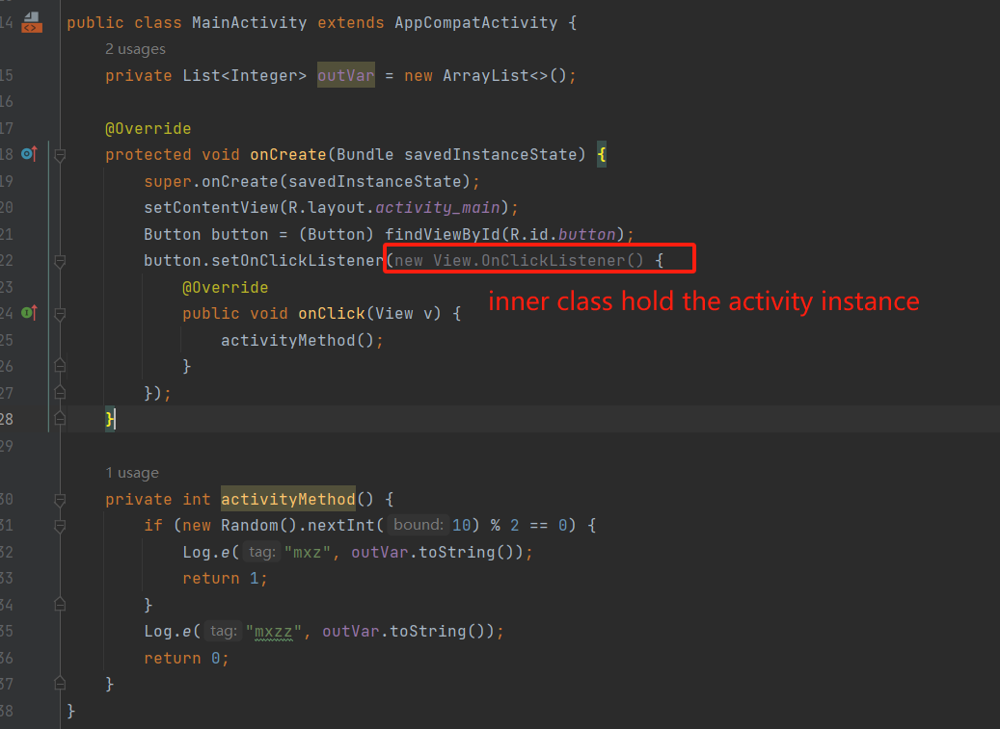

# InnerClassLeakCanary
Optimize android activity memory leaks caused by anonymous inner classes by replacing this$0 to weak references

what transform plugin do is
1. find all inner classes of activity (actually not finish yet)
2. replace field this$0 in inner class with mWeakActivity(WeakReference Type)
3. change all access to this$0 to mWeakActivity
4. add null check to mWeakActivity.get() 
5. if null, return immediately(0 for num and null for reference), perhaps there is another better way?
6. if not null,  just the same as the source codde

## demo

class content of inner class

class content of inner class after transfrom

